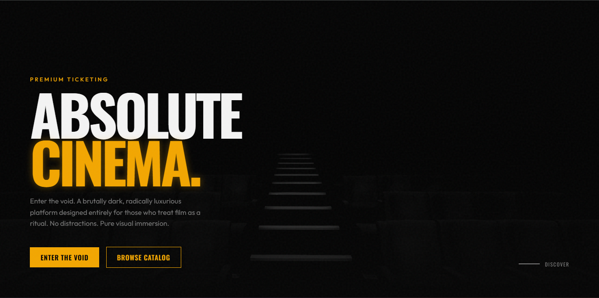
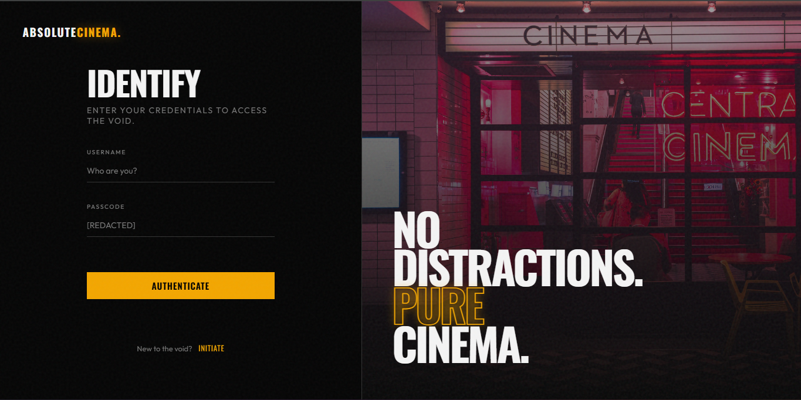
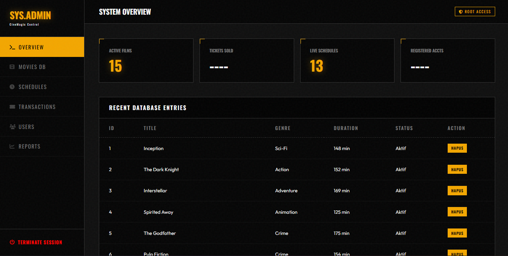
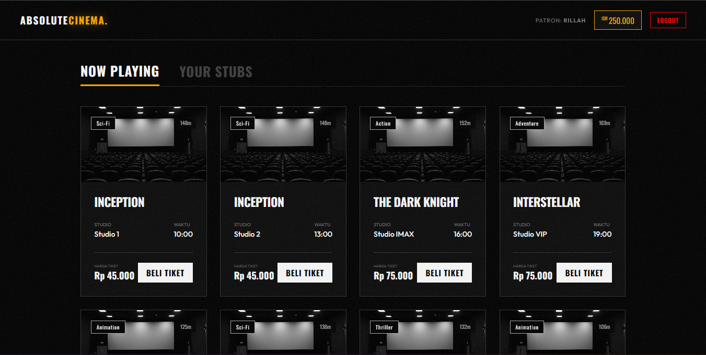

# Sistem Ticketing Bioskop

Sistem Ticketing Bioskop adalah platform manajemen tiket bioskop yang dirancang dengan design **Brutalist Dark**. Proyek ini menggabungkan backend berbasis Java Spring Boot dengan frontend menggunakan Vanilla HTML/CSS/JS.

## 🚀 Fitur Utama

### 👤 Pengguna (Customer)

- **Registrasi & Login**: Keamanan akses akun personal.
- **Katalog Film**: Telusuri film yang sedang tayang dengan tampilan imersif.
- **Pemesanan Tiket**: Pilih kursi secara visual dan beli tiket secara real-time.
- **Sistem Saldo**: Top-up saldo untuk kemudahan transaksi tanpa uang tunai.
- **Riwayat Tiket**: Lihat daftar tiket yang telah dipesan sebelumnya.

### 🛠️ Admin

- **Dashboard Manajemen**: Kelola seluruh ekosistem bioskop.
- **Manajemen Film**: Tambah, edit, atau hapus film dari katalog.
- **Penjadwalan**: Atur jam tayang film di berbagai tipe studio (Reguler, Premium, IMAX, VIP).
- **Manajemen User**: Pantau dan kelola data pengguna yang terdaftar.

## 🛠️ Tech Stack

- **Backend**: Java 21, Spring Boot (Web MVC)
- **Frontend**: HTML5, CSS3, Vanilla JavaScript
- **Penyimpanan Data**: CSV (File-based Persistence) - Data disimpan di `src/main/java/sistem/tiket/bioskop/data/`
- **Komunikasi**: RESTful API (JSON)

## Arsitektur Proyek

Proyek ini mengikuti pola arsitektur N-Tier/MVC sederhana yang dipisahkan menjadi:

- **Model**: Definisi objek data (User, Movie, Tiket, dll).
- **Repository**: Logika akses data dan manipulasi file CSV.
- **Controller**: Logika bisnis utama (Auth, Booking, Movie, Schedule).
- **Rest Controller**: Interface API untuk komunikasi dengan frontend.
- **Frontend**: Komponen UI yang terbagi menjadi modul `admin`, `customer`, dan `login`.

## 📡 API Endpoints (Ringkasan)

| Endpoint             | Method     | Deskripsi                   |
| :------------------- | :--------- | :-------------------------- |
| `/api/auth/login`    | POST       | Login pengguna              |
| `/api/auth/register` | POST       | Registrasi pengguna baru    |
| `/api/movies`        | GET / POST | Ambil/Tambah data film      |
| `/api/schedules`     | GET / POST | Ambil/Tambah jadwal tayang  |
| `/api/bookings`      | POST       | Pemesanan tiket baru        |
| `/api/users/topup`   | POST       | Top-up saldo pengguna       |
| `/api/tickets`       | GET        | Ambil seluruh riwayat tiket |

## ⚙️ Cara Menjalankan Proyek

### Prasyarat

- Java Development Kit (JDK) 21
- Maven installed (opsional, sudah disediakan `mvnw`)

### Langkah-langkah

1. **Jalankan Backend**:
   Buka terminal di root direktori proyek dan jalankan:

   ```bash
   ./mvnw spring-boot:run
   ```

   Backend akan berjalan di `http://localhost:8080`.

2. **Akses Frontend**:
   Buka file `frontend/index.html` di browser pilihan Anda (direkomendasikan menggunakan Live Server di VS Code).

## Struktur Direktori

```text
.
├── src/main/java/sistem/tiket/bioskop/
│   ├── controller/   # Logika Bisnis & API
│   ├── data/         # File CSV (Database)
│   ├── model/         # Objek Data
│   ├── repository/    # Akses CSV
│   └── utils/         # Helper (CSV Reader/Writer)
├── frontend/
│   ├── admin/        # Dashboard Admin
│   ├── customer/     # Portal Customer
│   ├── login/        # Halaman Login/Regis
│   └── index.html    # Landing Page
└── diagram.plantuml  # Dokumentasi Arsitektur
```

---

## 📸 Showcase Project

Berikut adalah tampilan antarmuka dari Absolute Cinema:

|               Landing Page               |                Halaman Login                 |
| :--------------------------------------: | :------------------------------------------: |
|   |          |
|           **Admin Dashboard**            |             **Customer Portal**              |
|  |  |

---
